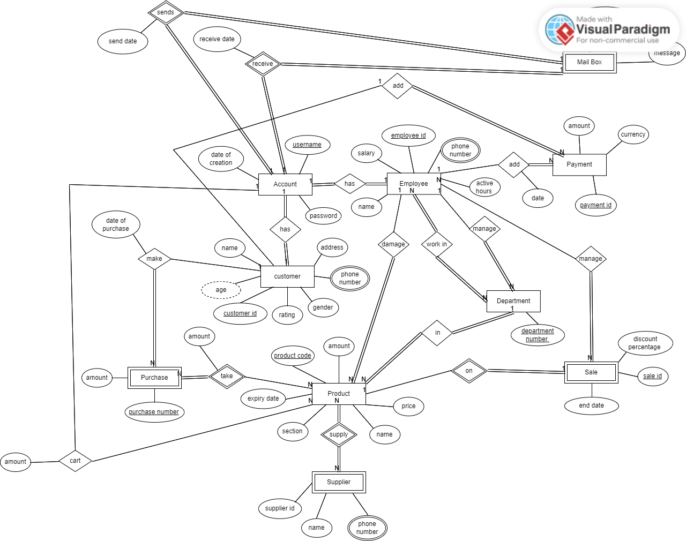

# 🛒 Shopping System

A **desktop-based shopping and delivery system** designed for **Jericho Mall** supermarket.
The goal of this project is to **improve sales** by allowing customers to explore available products and order them from home.  

---

## 📌 Project Summary
Our client wanted to enhance his supermarket’s sales and customer reach.  
Previously, orders were placed **via landline calls**, which was inefficient.  
This project introduces a **digital platform** where customers can browse products, place orders, and interact with employees/managers.  

The system ensures better **customer experience**, **data management**, and **sales tracking**.

---

## 🚀 Features
- Multi-user desktop application with role-based access.
- **Customer**: Browse products, purchase items, view order history, and rate employees.  
- **Employee**: Manage products (add, update, delete) and track work hours.  
- **Manager**: Full system control (manage employees, products, customers, and reports).  
- Product management with details such as code, name, expiry date, section, weight, amount, and price.  
- Order management (process number, date, product details, customer info, discount).  
- **Help center** with mailbox for customer support.  
- **Blacklist** for problematic customers.  
- **Top customers list** based on purchase activity.  
- **Sale list** with product discounts.  
- Every system action (buying, editing, adding, rating) is **recorded in logs**.

---

## 👥 System Users & Roles
1. **Manager**
   - Access to all system features.
   - Can manage employees and products.
   - Has salary and full reporting ability.

2. **Employee**
   - Can edit and manage products.
   - Has active hours, salary, and ratings.
   - Limited access compared to Manager.

3. **Customer**
   - Can explore and purchase products.
   - Has ratings, debt records, and purchase history.
   - Can rate employees and request support.

---

## 📐 ERD Diagram

